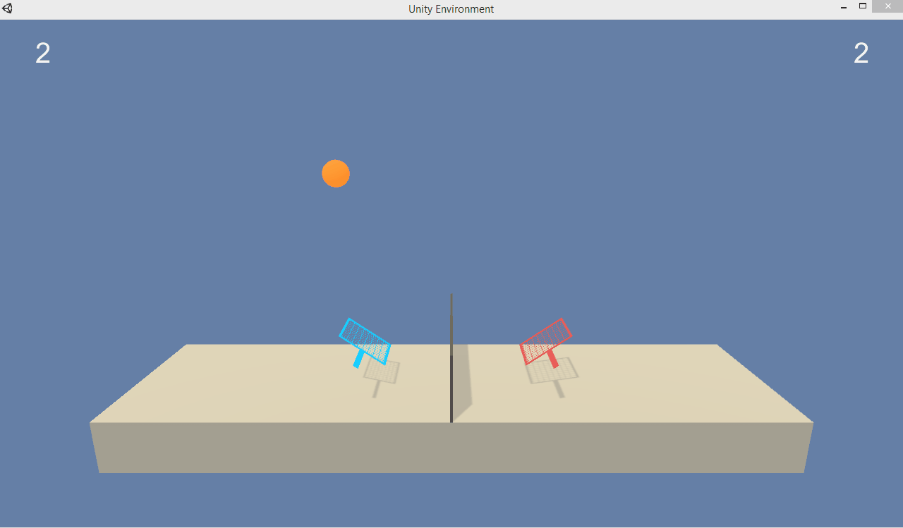

# DeepRL-Nanodegree-Project3 (CollaborationAndCompetition)

In this project, we will use a Multi Agent Deep Deterministic Policy Gradient (MADDPG) algorithm to train two agents to play Tennis!

### Environment Description

* Set-up: Two-player game where agents control rackets to bounce ball over a net.
* Goal: The agents must bounce ball between one another while not dropping or sending ball out of bounds.
* Agents: The environment contains two agent linked to a single Brain named TennisBrain. After training you can attach another Brain named MyBrain to one of the agent to play against your trained model.
* Agent Reward Function (independent):
  1) +0.1 To agent when hitting ball over net.
  1) -0.1 To agent who let ball hit their ground, or hit ball out of bounds.
* Brains: One Brain with the following observation/action space.
* Vector Observation space: 8 variables corresponding to position and velocity of ball and racket.
* Vector Action space: (Continuous) Size of 2, corresponding to movement toward net or away from net, and jumping.
* Visual Observations: None.
* Reset Parameters: One, corresponding to size of ball.
* Benchmark Mean Reward: 2.5

### Download Instructions

Here are the instructions to follow if you'd like to try out this algorithm on your machine. First you'll need at least Python 3.6 installed on your system. You will also need these libraries to help run the code. Most of these can be installed using the 'pip install' command on your terminal once Python has been installed.

1. numpy - NumPy is the fundamental package for scientific computing with Python
1. collections - High-performance container datatypes
1. torch - PyTorch is an optimized tensor library for deep learning using GPUs and CPUs
1. unityagents - Unity Machine Learning Agents allows researchers and developers to transform games and simulations created using the Unity Editor into environments where intelligent agents can be trained using reinforcement learning, evolutionary strategies, or other machine learning methods through a simple to use Python API
1. matplotlib.pyplot - Provides a MATLAB-like plotting framework

You can download the environment from one of the links below. You need only select the environment that matches your operating system:
  - Linux: [click here](https://s3-us-west-1.amazonaws.com/udacity-drlnd/P3/Tennis/Tennis_Linux.zip)
  - Mac OSX: [click here](https://s3-us-west-1.amazonaws.com/udacity-drlnd/P3/Tennis/Tennis.app.zip)
  - Windows (32-bit): [click here](https://s3-us-west-1.amazonaws.com/udacity-drlnd/P3/Tennis/Tennis_Windows_x86.zip)
  - Windows (64-bit): [click here](https://s3-us-west-1.amazonaws.com/udacity-drlnd/P3/Tennis/Tennis_Windows_x86_64.zip)
  
  ### File Descriptions

The repo contains 8 main files:
1. CollaborationAndCompetetion_Train.py - This file, written in Python 3.6 with the help of the PyTorch framework contains the maddpg function that we use to train the agents with. It runs until the agents have solved the environment which can vary between 1500 - 2000 episodes depending on the hyperparameter selection.

1. model.py - This file contains the neural networks for the Actor-Critic model.

1. agent.py - This file consists the Agent class and its methods/functions to interact with and observe the environment.

1. CollaborationAndCompetition_Test.py - This file can be used to test the trained agents. It runs for a total of 5 episodes and plots the performance in each of them.

1. checkpoint_actor_agent_0.pth and checkpoint_actor_agent_1.pth - These two files consist the agents' trained Actor weights. You may use these files if you'd like to use the pretrained agents to interact with the environment. These files also gets recreated every time you run the CollaborationAndCompetition_Train.py file. So you can create your own checkpoint files with your choice of hyperparameters!

1. checkpoint_critic_agent_0.pth and checkpoint_actor_agent_1 - These files consist of the agents' trained Critic weights. This also gets recreated every time you run CollaborationAndCompetition_Train.py.

### How to run the code?

- Clone/download the 8 files listed above and add them in the same folder as the Tennis environment on your machine. You can run the code using a terminal like Anaconda Prompt or anything that can run python commands like 'pip.
- Once you navigate to the folder where the project files are located using the 'cd' command, run either 'CollaborationAndCompetition_Train.py' file if you'd like to train your own agent or 'CollaborationAndCompetition_Test.py' if you'd like to see a pretrained agent in action!

Please refer to the Report.md file if you'd like an in-depth look of the architecture.

